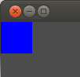

## GUIチュートリアル

### イントロダクション

プログラマーが激しく嫌いな何かがあるとすればGUIのプログラミングでは無いでしょうか。退屈でかつ新しい物を作っているという実感が湧きにくいです。GUIのプログラミングには次のような原因で複雑になります:

* ピクセルのアライメントが取りづらい。(デザイン全般に言えることですが。)

* テスト中に変更がある度に変わる。

* 表示解像度によって修正を加える必要がある。

* スクリーンのコンポーネントの中にはアニメーションが必要なものもある。

GUIのプログラミングはプログラマが消耗する作業の一つです。Godotの開発(おそらく既存のエンジンは大体そうですが)は、イミディエイトモード、コンテナ、アンカー、スクリプティングなどの様々な技術や哲学の元になされました。これらにはユーザーインターフェースを編集する間のプログラマーのストレスを軽減するという目的がありました。


結局、GodotはUIサブシステムについては、いくつかのアプローチを通じて効果的な解決を図っています。他のツールキットに比べて習得の効率が高いと同時に、デザイナーやアニメーターが共に使えるデザインにすることで、デベロッパーはわずかな時間でUIをまとめることが出来ます。

### コントロール

UIエレメントのベーシックノードは"Control"です。他のツールでは"Wiget"や"Box"などと呼ばれます。UIの機能を提供するあらゆるノードは、コントロールから派生しています。

Controlがシーンツリーにおいて他のControlの子ノードとなっている時、親を基準にした位置や大きさになることを意味します。これは複雑なUIを速く、分かりやすく編集する基礎となります。

## 入力と描画

ControlはControl._input.event()コールバックによって入力イベントを受け付けます。フォーカスされたControlだけが、キーボードやジョイパッドのイベントを受け取ります。(詳しくはControl.set_focus_mode()とControl.grab_focus()を参照してください。)

マウスモーションイベントはマウスポインターの直下のControlによって直接受け取られます。Controlがマウスボタンの押下イベントを受け取ると、そのボタンが離されるまではそのControlがマウスイベントを受け取ります。Controlをはみ出したとしてもです。

Controlを始めとするCanvasItemを継承する全てのクラスにおいて言えることですが、CanvasItem._drow()コールバックが最初に受け取られ、毎回Controlは書き変えられます。プログラマーはCanvasItem.update()を呼び、CanvasItemを書き換えのためのキューに入れる必要があります。Controlが表示されて無く、更に別のCanvasItemも表示されていない時。Controlはどんな入力も受け付けません。

一般的にも、UIをビルドする時、プログラマーは描画処理や入力に直接対処する必要はありません。これはカスタムControlを作成する際により便利さを実感できるでしょう。アクションを起こしたい時のためにControlはコンテキスト情報を含む色々な種類のシグナルを発生させます。例えば、Buttonは押されたことを示す"pressed"シグナルを発生させ、Sliderはドラッグされた時に"value changed"シグナルを発生させます。

## カスタムControlミニチュートリアル

Controlのネストが深くなる前にカスタムControlを検討しましょう。カスタムControlを作るという作業は、どのように動いているか分かりやすく実装する良い手段となります。おそらく入れ子のネストの深いControlよりは複雑にならないかと思います。

加えて、もしGodotに様々な動作をするControlが大量にあるとして、新しいカスタムControlを作った方が実装が楽になるケースがよくあります。

初めにシングルノードのシーンを作ります。このノードはタイプに"Control"を指定し、この用に2Dエディタで一定の面積を持たせて下さい。


ノードにスクリプトを加えます。次のコードです:

```python
extends Control

var tapped=false

func _draw():

    var r = Rect2( Vector2(), get_size() )
    if (tapped):
        draw_rect(r, Color(1,0,0) )
    else:
        draw_rect(r, Color(0,0,1) )

func _input_event(ev):

    if (ev.type==InputEvent.MOUSE_BUTTON and ev.pressed):
        tapped=true
        update()
```

シーンを実行してください。長方形がクリック、またはタップされると、色が青から赤に変わります。このイベントと描画の協調は殆ど全てのControl内部で起こります。




### 複合的なUI

先ほど述べたように、Godotにはユーザーインターフェースとして使える沢山のControlが用意されています。Controlは2つのカテゴリに分けることが出来ます。多くのゲームのUIで使える小さなControlのセットと、複合的なUIと統一感のある見た目のためのものです。ほとんどは後者になります。どちらがどんな場合に使われるかを以下に示します。

#### シンプルなUI用のControl

このcontrolのセットはほとんどのゲームにおいて十分使えるものです。そもそもUIは複雑な相互作用や情報の表示などを実装しようと意気込んで作りこんで行く必要の無いものであることを念頭に置いてください。これらは規則性のあるテクスチャーを簡単に貼ることが出来ます。

* Label: テキストを表示する

* TextureFrame: テクスチャを一つ表示、大きさを変える設定や固定する設定が出来る

* TextureButton: テクスチャの貼られたシンプルなボタンを表示、pressed、hover、disabledなどのステートがあり、設定出来る。

* TextureProgress: テクスチャの貼られたプログレスバーを表示

そして、Controlの再配置にはこの場合ではアンカーを使うのが楽です。詳しくはサイズとアンカーのチュートリアルを見てください。いずれにしても、単純なゲームでもこれらでカバーし切れないUIが必要な場合があります。

例えば、スクロール出来るハイスコアや用例などのリストを表示する時などです。そんな場合であれば合わせてScrollCountainerやVBoxContainerを使います。

このようなより先進的なControlの種類は普通のものとシームレスに合体させることが出来ます。それらも全てControlの仲間です。

#### 複雑なUI用のControl

他のものはこちらに分類されます。ほとんどのControlがこちらの仲間です。普通シナリオのために使われます。

* ゲームには複雑なUIを要求するものがあります。例えば、RPG、MMO、戦略ゲーム、シミュレーションゲームなどです。

* カスタムデベロップメントツールを作ることで、コンテンツの作成をスピードアップすることが出来ます。

* Godot Edoitor Pluginを作ることで、エンジンの機能を拡張することが出来ます。

これらを再配置するには通常コンテナが用いられます。詳しくはサイズとアンカーのチュートリアルを見てください。
