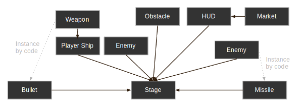

## インスタンス化(続き)

### 要点

インスタンスには様々な便利な使い方があります。今まで学んできたものを列挙すると

* シーンを分割し、管理しやすくする機能がある
* プレハブのようで柔軟性があるもの(インスタンス化はより複雑なゲームを作る時にこそ力を発揮します)
* ゲームフローやユーザーインターフェースなどを複合的にデザインする手段となる(ユーザーインターフェースの要素はGodotではノードとしても実装されています)

### 設計用言語

シーンをインスタンス化する本当のメリットは、美しい設計用言語の下で動くということにあります。このことがGodotが特殊で他のゲームエンジンと違っていることの最大の理由です。このエンジンは全て美しい言語設計で動くことを念頭に置いて設計されています。

Godotでゲームを作る時、MVCや実体関連図を使わないアプローチが推奨され、もっと自然な方法でゲームを考え始めることが出来ます。見える要素から設計を初めてください。

ゲームで見えるものをイメージする所から始めて下さい。見えるものというのは、プログラマーだけでなく誰からでも見えるものと言う意味です。

例えば、これはシンプルなシューティングゲームでイメージ出来るものです。

とても簡単に書き起こすならば、どんなシューティングゲームもこんな感じになります。あなたの頭の中にあるエレメントを書き出し、所有していることを意味する矢印を書き加えます。

こんな図を一度書いてしまえば、ゲーム作りはシーンやそれぞれのノードを作り、コードやエディタからインスタンスを作成することで所有させると言うことに置き換わります。

ゲームをプログラムする殆どの時間は、ほとんどのソフトウエアを作る際にも言えることですが、アーキテクチャをデザインしそのアーキテクチャに素材をフィッティングすることで浪費されます。シーンに基づく設計はそれに代わり、開発をより速く、より直感的にし、ゲーム製作そのものに集中できるようになります。シーン/インスタンス化、に基づくデザインは驚くほど効率的で、開発にかかる手間を節約でき、素材ののデザインマップをそのままシーンに落とし込めます。この方法なら少し構造的なことを考えるだけで済みますし、場合によっては要らなくなることもあります。

下の画像は、オープンワールドなゲームの様々な資産やパーツとその関係というより複雑な例です。

Godotならもっとシーンを作りインスタンス化するだけで、お望み通りのスピードでゲームを拡張することができます。エディターのUIはノンプログラマーでも扱うことができます。チーム開発は普通2D/3Dアーティストやステージのデザイナー、ゲーム全体のデザーナーやアニメーターなど沢山の人で行うのでそんなインターフェースになっています。

## 一辺に言うな、分からん

そんなことを思った人も心配することは無いと強く申し上げておきます。このチュートリアルで重要な点は、シーンやインスタンスの使い方が現実に即していると言うことです。理解への最短ルートはとにかくどんなゲームでも良いので作ってみるということです。

実践を積めば全てについて見通しが良くなります。なので分からなくても深く考えないで、とりあえず次のチュートリアルへ行ってください。
