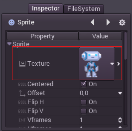

## リソース

### ノードとリソース

これまでは、Godotではノードが最も重要なデータタイプで、エンジンの振る舞いや特徴はそれらを通して実装されていました。しかし同じくらい重要なデータタイプがもう1つあります。それがリソースです。

ノードのフォーカスするところは、スプライトの描画や3DCGの描画、物理エンジン、GUI Controlなどの振る舞いでした。

リソースはただのデータコンテナです。これは、それらが動くことが無く情報を一切処理しないことを示します。リソースはデータを保持するだけです。

リソースの例は、テクスチャ、スクリプト、メッシュ、アニメーション、サンプル、オーディオストリーム、フォント、トランスレーションなどです。

Godotがシーン(.scn ,xml)、イメージ(.png .jpg)、スクリプト(.gd)その他様々なものをディスクからセーブ、ロードするとき、そのファイルは資源として扱われます。リソースがディスクからロードされる時は常に一度のみです。これはつまり、メモリにロード済みのリソースが存在するならば、そのリソースを複製して使い、何度もロードしないということです。

通常、Godotの全てのオブジェクト(ノード、リソースその他)はプロパティを様々なタイプ(string,integer,Vector2など)でエクスポートでき、これらのタイプのデータはリソースになり得ます。つまり、ノードとリソース両方をプロパティとしてリソースに格納することが出来るということです。これを視覚的に表すと


### エクスターナルVSビルドイン

リファレンスプロパティはエクスターナル(ディスクから)とビルドインの2つの方法でリソースを参照できます。より具体的に話をしましょう。テクスチャとスプライトノードがありますね。



プレビューの右端の">"ボタンを押すと、リソースプロパティを参照、編集できます。プロパティの一つであるPATHはそれがどこから読み込まれているかを示します。この場合はあるPng画像が読み込まれていることが分かります。


リソースがファイル由来の時、それはエクスターナルリソースに数えられます。PATHプロパティが消されるか、そもそもPATHプロパティがない場合、それはビルドインリソースに数えられます。

例えば、上記の例でPATHから"res://robi.png"を消し、そのシーンを保存したとして、そのリソースは.scnファイルの中に格納され、外部から参照無する必要がなくなります。たとえビルドインとして保存し、そのシーンを何度もインスタンス化して使用したとしても、リソースは一度だけ読み込まれます。つまり、同時にインスタンス化したとして、それらは同じイメージを共有するのです。

### コードを用いてリソースを読み込む

コードをリソースからロードするのは簡単で、その方法は2つあります。1つめはこのようにload()を使うことです。

```python
func _ready():
        var res = load("res://robi.png") # resource is loaded when line is executed
        get_node("sprite").set_texture(res)
```

2つめはより最適化された方法ですが、リソースがコンパイル時に読み込まれるため固定値の塊として読み込んでしまいます。

```python
func _ready():
        var res = preload("res://robi.png") # resource is loaded at compile time
        get_node("sprite").set_texture(res)
```

### シーンのノード

シーンはリソースでもありますが、掴みどころがあります。ディスクに保存されたシーンはPackedSceneタイプです。これはシーンがリソースの内部に入っていることを示します。

シーンのインスタンスを得るためには、PackedScene.instance()メソッドを使う必要があります。

```python
func _on_shoot():
        var bullet = preload("res://bullet.scn").instance()
        add_child(bullet)
```

このメソッドは構造(プロパティに設定したもの)とシーンのルートノードで構成される階層としてノードを渡します。それは他のノードに加えることも出来ます。

このアプローチにはいくつか利点があります。まずPackedScene.instance()がとても速くなり、コンテンツの追加がとても効率的に行えます。新しい敵、弾丸、エフェクトなどの追加と削除がロード時間を短縮してとても速く行えます。

イメージやメッシょなどがシーンのインスタンス間で常に共有されていることは覚えておいてください。

### リソースの解放

リソースはリファレンスを継承しています。よって、リソースが必要無くなった時は自動的に解放されます。殆どの場合リソースはノードやスクリプトなどの別のリソースを格納していますが、ノードが削除または解放されたとき、その子リソースも全て解放されます。

### スクリプト

ノードだけでなく、Godotの全てのリソース内のオブジェクトには、スクリプトを付加することが出来ます。しかしリソースは単なるデータコンテナーとしての用途が一般的ですので、普通は採用されません。
