## シーンとノード

### イントロダクション

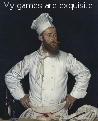

あなたがゲームデベロッパー以外の誰かであると言う想像を少ししてみましょう。今あなたはシェフだとします。気の効いた話が出来るよう準備し、よそ行きの服を着ているとしましょう。ゲームは作りません、代わりに客をもてなす新しいレシピを作ります。

さて、シェフはどうやってレシピを作るでしょうか。レシピは2つの構成要素に分けられます。第一に材料、第二に段取りです。レシピを作ってしまえば、誰もがそれに従って料理を作り、あなたの創りだした料理を味わうことが出来ます。

Goditでゲームを作る時、これと同じだと感じることが多々あります。ゲームエンジンを使うことはキッチンに立つことと似ています。このキッチンにあたるノードには、冷蔵庫があって新鮮な食材があります。

### ノード

それでは基本から参りましょう。ノードはゲームを作る上で基本となる構成要素で、以下のような特徴があります。

* 名前が付いている

* プロパティを編集出来る

* フレーム毎に、プロセスからコールバックを受け取れる。

* 拡張可能である(関数が持てる)

* 子ノードを追加出来る

最後の特徴は特に重要です。ノードは別のノードを子ノードとして持てます。これはノードは木構造を形成するとも言えます。

Godotでは、このようにノードを編集することでプロジェクトを計画する上でパワフルなツールを作ります。違う関数を持つ違うノードを組み合わせると、それらはより強い関数となることが出来ます。

まだハッキリとは分からないかと思いますが、少しは感覚がつかめて来たでしょうか。よく分からなくてもどんどん先へ進んでしまいましょう。この章で大事なことはノードというものがあって、それが色々編集出来ると言うことだけです。

## シーン

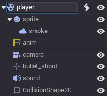

さて、ノードの説明をしたので、次はシーンという仕組みについて説明します。

シーンは木構造のように階層化されたノードのグループからなります。以下のような特徴があります。

* シーンは常にルートノードを一つしか持たない。

* シーンはセーブ/ロードが出来る

* インスタンスを生成出来る(詳細は後ほど)

* ゲームの実行はシーンの実行である

* シーンはプロジェクトにいくつも格納できるが、最初にロードするシーンを一つ決めなければならない

## 新しいプロジェクトを作る

理屈ばかりではつまらないですね。実践に移りましょう。チュートリアルの古くからの伝統に従って、まずはHello Worldからです。エディタを使ったHello Worldをやってみましょう。

Godotがプロジェクトの外で実行される時、プロジェクトマネージャーが開きます。これはデベロッパのプロジェクトの管理を助けるツールです。

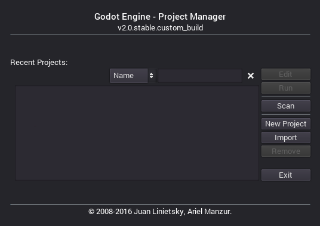

新しいプロジェクトを作るには"New Project"オプションを使います。プロジェクトのパスを設定し、プロジェクト名を付けましょう。

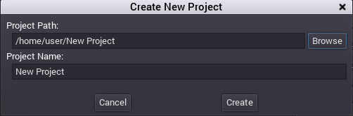

## エディタ

新しいプロジェクトが作られると、次のステップが開かれます。ここで開かれるのがGodotエディタです。このような画面になっているはずです。

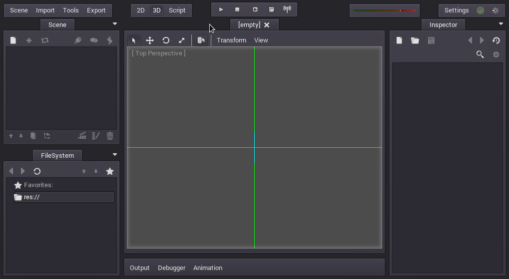

先ほど言ったように、Godotでゲームを作るのはキッチンに立つのと似ていて、さて、冷蔵庫を開けてプロジェクトに新鮮なノードを追加しましょう。Hello Worldの始まりです。それではNew Nodeボタンを押しましょう。Sceneペインの一番左のボタンです。

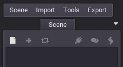

そうするとCreate Nodeダイアログが開き、作ることの出来るノードが並びます。

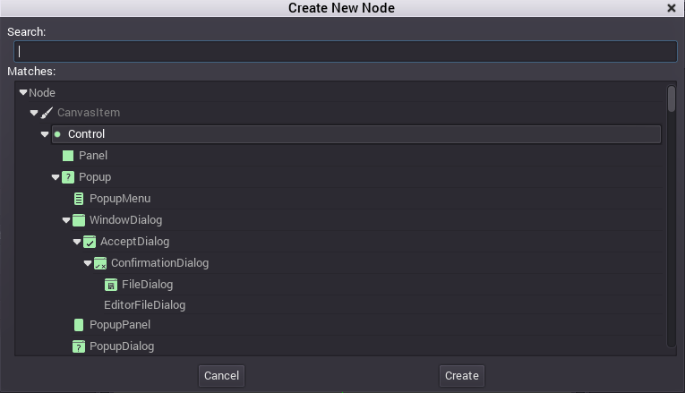

最初はLabelノードを選んでみましょう。検索窓を使うのが最も速いと思います。

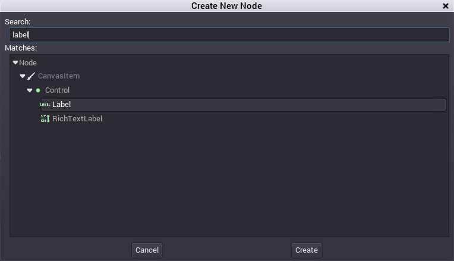

そしてCreateを押しましょう。何か色々画面が変わりますね。

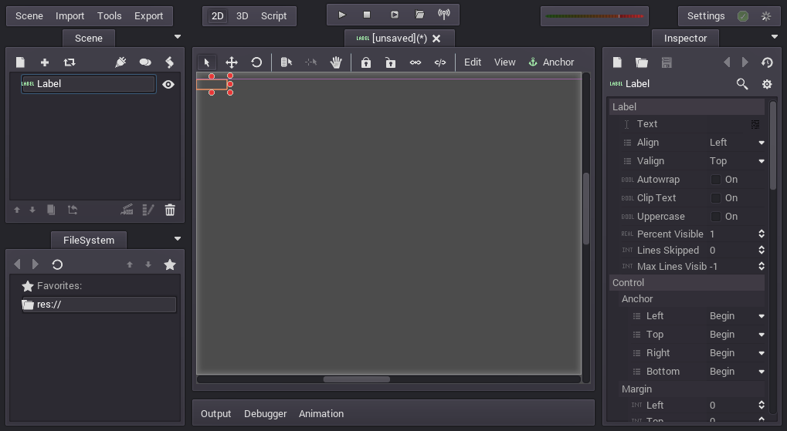

まず、シーンは2Dエディターに変化しました。Labelは2Dのノードタイプなのです。そして、ラベルが表示域の左上に出現し、選択されています。

このノードは左上のボックスのシーンツリーエディタにも表示されています。そしてその詳細が右端のインスペクターに表示されています。

次はラベルの"Text"プロパティを変更してみましょう。Hello Worldに変えてみます。

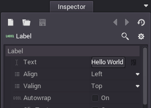

これでシーンを実行する準備は整いました。トップバーにあるPLAY SCENEボタンを押してください。F6キーを叩いても実行できます。

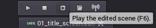

おっと

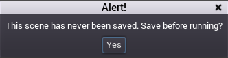

シーンの実行するにはまず保存する必要がありました。Scene -> Saveからhello.scnのような名前を付けて保存しましょう。

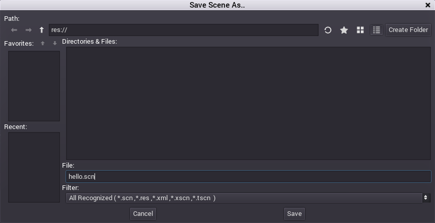

この画像では面白いことが起きています。このファイルダイアログは特別なもので、プロジェクトの内部にシーンなどをセーブするものです。プロジェクトルートはres://でこれはresource pathを表します。このダイアログからシーンはプロジェクト内にセーブするものであることがわかりますね。この先、Godotでファイルを操作する際にres://はリソースパスであること、環境やインストールされた場所に関係なく、リソースファイルはゲーム内に格納されていることを覚えておいてください。

シーンをセーブしたら、再び実行してみましょう。Hello Worldはこのような実行結果が出たら完了です。

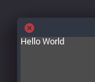

成功しました

## プロジェクトの設定

プロジェクトの設定をいくつかやってみましょう。先ほどのは現在のシーンを実行したに過ぎませんでした。しかしプロジェクトはメインシーンが一つ設定されたいくつかのシーンからなっています。メインシーンとはプロジェクトが実行された際に実行されるシーンのことです。

そのような設定は全てengine.cfgファイルに格納されていて、plaintextかwin.iniフォーマットとなっており、簡単に編集可能です。沢山の設定項目があり、プロジェクトの振る舞いを変えることが出来ます。設定ファイルを簡単に作るために、プロジェクトセッティングダイアログが存在します。これはengine.cfg編集用のフロントエンドに当たりますね。

このダイアログにはScene -> Project Settingsから簡単にアクセス出来ます。

ダイアログを開いたらメインシーンを設定しましょう。これはApplication/main_scene のプロパティを選んでhello.scnを選択することで設定が完了します。

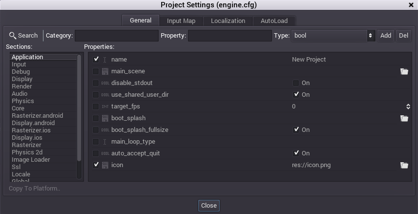

正規のPlayボタン(F5)を押すと、どんなシーンを編集しているかに関わらず、ここで設定したメインシーンからプロジェクトが始まります。

プロジェクトセッティングダイアログに話を戻しましょう。このダイアログにはengine.cfgに追加出来る様々なオプションとそのデフォルトの値が表示されます。

これは少し趣旨から外れていますが今後の参考のために覚えておくと良いでしょう。Godotにはカスタムコンフィグレーションオプションと言うものがあり、拡張機能をランタイムとして読み込むことが出来ます。

## To be continued...

このチュートリアルではノードとシーンの話をしましたが、一つのノードと一つのシーンだけだったので、道のりは長いなと感じた人もいるかも知れません。しかし心配は要りません。今は多くは語りませんが、この言葉の意味はこれからのチュートリアルをこなしていけばわかるはずです。
