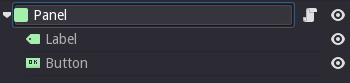
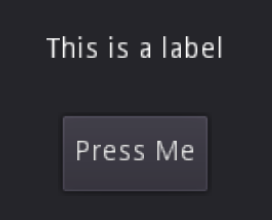
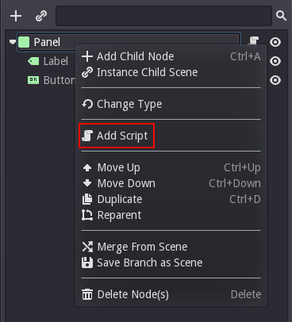
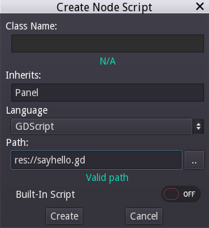
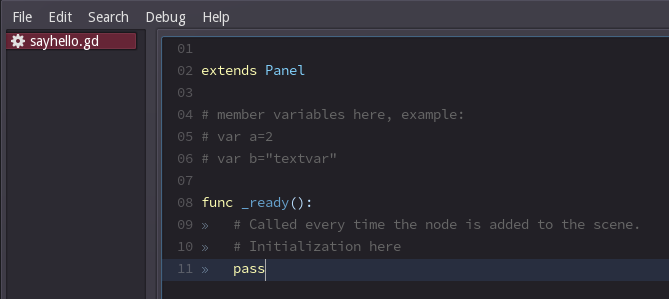
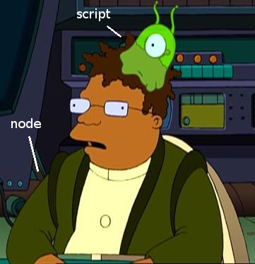
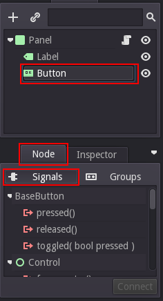
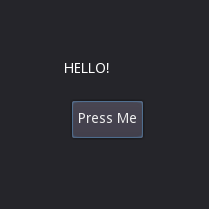

## スクリプティング

### イントロダクション

プログラミングを覗いたゲームの作成にに関するツールについて沢山のことがのべられました。個人単位の多くのデベロッパーにとってコードを学習せずにゲームを作れると言うことは夢のような話でしょう。企業にとってさえ、ゲームフローの制御を考えるばで、このゲームデザイナーの願望とも言えるニーズは長い間議論になっています。

たくさんの製品が趣向を凝らしたプログラミング無しの環境を提供していましたが、それらはどれも不十分で、とんでもなく複雑になったり、従来のコードによる製作に対して能率が悪かったりしました。結果的に、プログラミングはゲーム制作に残り続けて来たわけです。実際、ゲームエンジンの全体的な傾向はいかにコードの量を減らすためのツールを追加し、明確なコードによる開発を加速させるかということになっています。

この方針に準じて、Godotの様々な使いやすいデザインが決定されていきました。最初にして最重要なのはシーンシステムです。最初はどのコードが何を担当しているのか明確ではありませんでしが、後に大幅に改善され、プログラマーが開発をしやすくなりました。

このシーンシステムでゲームを作る時、プロジェクト全体は相補的なシーンわけられます。独立したシーンは現れません。分離されているということは、シーンは相互に補完されるということです。この後多くの例が現れますがこのことはとても重要なので覚えておくと良いでしょう。

プログラミングに精通している人は気づくかもしれませんが、これはMVCとは異なるものです。Godotは相補的なシーンのモデルに置き換えることによって、MVCをやめる手間以上の効率化を約束します。

Godotは他にもスクリプトの拡張をサポートし、全ての既存のエンジンクラスはスクリプトによって拡張することが出来ます。


### GDスクリプト

GDスクリプトはGodotに組み込まれた動的型付けのスクリプト言語です。以下を目標にして設計されています。

* 最重要事項として、まずシンプルさを追求しています。プログラマが見慣れていて、可能な限り学習コストを抑えるように設計されています。

* コードが可読性に優れミスが起きにくいように設計されています。文法はPythonから借りています。

プログラマーなら大体数日で学べてしまい、二週間もすれば慣れてしまうでしょう。

多くの動的型付け言語に当てはまることですが、生産性の高さ(言語の学習のしやすさ、コードを書く速さ、コンパイルが要らない点など)とパフォーマンスの低下のバランスを取る必要があります。ベクトル演算や物理演算、数値演算、インデックスなどのシビアなパフォーマンスが要求されるコードはこのエンジンでは内部的にC++で書かれていて、ほとんどのタイプのゲームで十分なパフォーマンスを発揮できます。

全てのケースで、もしパフォーマンスが欲しい時はクリティカルな部分をC++によって書き直すことも出来て、それらはスクリプトから見て分かりやすいように表示されます。ゲームの他の部分を変更することなしに、GDスクリプトクラスをC++クラスに置き換えることが出来るのです。

### シーンのスクリプティング

続ける前にGDスクリプトのリファレンスを参照することをおすすめします。これはシンプルな言語で、リファレンスも短いです。読み込む必要はありません。むしろ2-3分ちらっと見る程度をオススメします。

#### シーンのセットアップ

このチュートリアルはGUIの簡単なシーンをスクリプティングすることから始めます。add nodeダイアログを使って以下に示す階層を以下のノードで作りましょう。

* Panel
	* Label
	* Button

シーンツリーがこのように見えれば正解です。



2Dエディターではこのように見えるようになるはずです。これなら意味が分かりますね。



最後にシーンを保存します。"sayhello.scn"とでも名付けましょう。

### スクリプトを追加

パネルノードを右クリックし、コンテキストメニューから"Add Script"を選択します。



スクリプト作成ダイアログがポップアップします。このダイアログは言語を選んだり、クラス名を設定したりできます。GDスクリプトはクラス名を設定しませんので、クラス名のフィールドは編集出来なくなります。このスクリプトは"Panel"を継承させます。これはパネルタイプのノードの拡張を意味し、このフィールドは自動的に埋められます。

スクリプトのパスを設定して、"Create"を選択しましょう。



これがだけで、スクリプトが作成されノードに追加されます。ノードにアイコンが新しく追加され、スクリプトプロパティはこのようになるでしょう。


スクリプトを編集するには、ハイライトされているボタンを選択します。ボタンを押すとスクリプトエディタがテンプレートを含んだ状態で出現します。



少ししかソースコードが書かれていませんね。"\_ready()"関数はノードやその子ノードがアクティブになった時に呼ばれる関数です。これはコンストラクターでは無いです。コンストラクターは"\_init()"です。

### スクリプトの役割

スクリプトはノードに挙動を与えます。ノードの機能をコントロールするのに使われ、親ノード、子ノード、兄弟ノードにも影響を与えます。スクリプトのローカルスコープはそのノードのための空間で普通に継承されます。そしてノードの仮想関数はスクリプトによって書き換えることが出来ます。



### シグナルの操作

シグナルはGUIのノードで扱うことが殆どです。シグナルは特定の種類のアクションが起こる時に"emitted"され、様々な関数や、スクリプトのインスタンスと関連付けることができます。ここでは、ボタンから発生する"pressed"シグナルをカスタム関数に紐付けます。

スクリプトでシグナルを操るインターフェースはエディタに用意されていて、それにはシーンツリーでノードを選択し、ノードタブを選ぶことでアクセスできます。シグナルを選択していることを確認してください。



とにかく、ここで注目すべきなのは明らかに"pressed"シグナルでしょう。グラフィカルなインターフェースでもできあすが、コードを用いてこのシグナルを活用するとしましょう。

シグナルを利用するために、Godotを使うプログラマーの殆どが使う関数があります。Node.get_node()関数です。この関数は現在の木構造かシーンのどこかにあるノードを呼び出すためにパスを用い、ノードはスクリプトに保持されます。

ボタンを呼び出しましょう。以下のような命令を使います。

```python
get_node("Button")

```

次に、ボタンが押された時のコールバックを記述してみましょう。ラベルのテキストを書き換えるようにします。

```python
func _on_button_pressed():
	get_node("Label").set_text("HELLO!")
```

最後に"pressed"シグナルとそのコールバックを\_ready()にて繋げます。使う関数はObject.connect()です。

```python
func _ready():
	get_node("Button").connect("pressed,self,"_on_button_pressed")
```

スクリプトは最終的には次のようになっているはずです。

```python
extends Panel
# member variables here, example:

# var a=2
# var b="textvar"

func _on_button_pressed():
	get_node("Label").set_txt("HELLO!")
	
func _ready():
	get_node("Button").connect("pressed",self,"_on_button_pressed")
```

シーンを実行し、ボタンを押すと次のようになるでしょう。



注意: これはこのようなチュートリアルをする際によくあるミスなのですが、get_node(path)はスクリプトが保持されているノード(ここではPanel)の直接の子供について動いています。上記のコードで動くには、ボタンはパネルの直接の子供でなければなりません。もう少し詳しく言うと、ボタンがラベルの子の時、スクリプトは以下のように書かなければいけません。

```python
# not for this case
# but just in case
get_node("Label/Button")
```

また、ノードはタイプでなく、名前で参照されることを覚えておいて下さい。
