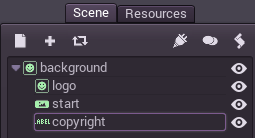
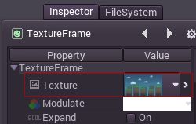
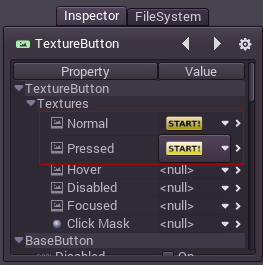
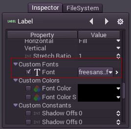

## 見栄えするスクリーン

### チュートリアル

これはGUIサブシステムの動き方の基本を固めるためのシンプルなチュートリアルになります。目標はシンプルで、静的で見栄えの良いスクリーンを作ることです。

下のファイルにはここで使われる素材が入っています。これらは直接プロジェクトフォルダに入れることが出来ます。インポートの必要はありません。

[robisplash_assets.zip](http://docs.godotengine.org/en/latest/_downloads/robisplash_assets.zip "robisplash_assets.zip" )

### セットアップ

プロジェクトセッテイングで画面解像度を800x450に設定してください。

ノード"background"と"logo"はTextureFrameタイプです。これらには表示するテクスチャーをセットする特殊なプロパティがあり、対応するファイルをロードします。

ノード"start"はTextureButtonで、ステート毎にいくつかの画像を表示します。デフォルトでは次の例のように表示されます。

最後に、ノード"copyright"はラベルです。ラベルはカスタムフォントを以下のプロパティを編集することで設定できます。

フォントはTTFがインポート出来ます。フォントのインポートを見てください。
