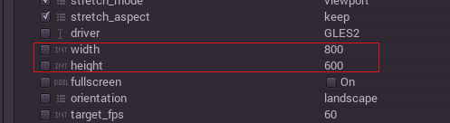
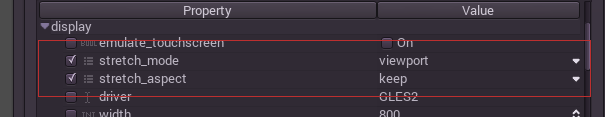
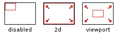

## 複数の解像度

### 基本解像度

プロジェクトのベーススクリーンの解像度は、プロジェクトセッティングで指定することが出来ます。

しかし、解像度の設定が確実に適用されるとは限りません。PC上で動く時、エンジンはこの解像度をセットしようと試みます。それが失敗した時はより小さな解像度を使います。モバイル端末やモバイルコンソールで実行する時は、端末の規定値かフルスクリーンの解像度になり、この設定は無視され代わりにネイティブ解像度が使われます。これを補うために、Godotはスクリーンを別のサイズにリサイズもしくは引き伸ばす、ということを制御する様々な手段が用意されています。

### リサイズする

様々なタイプのデバイスがあって、様々なタイプのスクリーンがあります。動揺に様々な画素密度や解像度が世の中にはあります。それらを全て扱うということは多くの仕事であり得るので、Godotはそんなエンジニアの宿命を少しだけ楽にする仕組みを用意しました。ビューポートノードにはリサイズを扱うための関数がいくつか用意されています。そしてシーンツリーのルートノードは常にビューポートです。(ロードされたシーンは子ノードインスタンス化されます。そのシーンの内部にはget_tree()、get_root()、get_node("/root")を用いることでアクセス可能です。)

とにかく、ルートビューポートの値が変えることがほとんど確実にこの課題を解決するための最も柔軟な方法で、コードやゲシング(Guessing)など様々な場面で使われるので、Godotは複数の解像度を制御するためにパラメーターのシンプルなセットを用意しています。

### ストレッチ設定

ストレッチ設定はプロジェクトセッティングにあり、数個の設定によってなされる変数のコンフィグレーションの集まりとして実装されています。

### ストレッチモード

* Disabled: 初めはこのストレッチモードです。デフォルトではストレッチは無効になっていて、これは画面が伸び縮みしないことを意味します。(より大きなスクリーンやウィンドウでは、解像度は大きくなります。常にピクセルと1:1です。)

* 2D: このモードでは、プロジェクトセッティングの中で、display/widthとdisplay/heightで指定された解像度が画面全体を覆うように引き伸ばされます。これは3Dは影響を受けずに(高い解像度であればそれに応じてレンダリングされる。)2Dはより高い解像度では単純に大きくレンダリングされるということです。

* ビューポート: ビューポートスケーリングは他のものとは少し違います。ルートビューポートをレンダーターゲットとしてセットし、プロジェクトセッティングのDisplay/Sectionで指定された解像度に応じて正確に静的にレンダリングします。最後に、このビューポートがスクリーンにフィットする用に引き伸ばされます。ピクセルが正確な位置に無ければいけないゲームや、低い解像度へのレンダリングの時に操作性を確保したい時などに役に立ちます。

### ストレッチアスペクト

* Ignore: 引き伸ばしを行う時にアスペクト比を無視します。これはつまり、もし幅が広くなったり狭くなったりしても、画面が新しい解像度にフィットするように引き伸ばされると言うことです。

* Keep: スクリーンを引き延ばす時に、アスペクト比がキープされます。画面を新しい解像度にフィットさせる時スクリーンのサイドや上下に黒いバーが現れることがあります。

* Keep Width:  アスペクト比を保ってスクリーンが引き伸ばされますが、結果としてスクリーンの高さが、指定された解像度よりも高くなる場合は垂直に引き伸ばされます。(高くなった縦解像度はビューポートで整理されます。)これは、スケーラブルなグラフィカルユーザーインターフェースやヘッドアップディスプレイを普通に設計するのにはベストな方法で、このオプションのために下端にアンカーを打てるControlが用意されています。(サイズとアンカー)

* Keep Height: アスペクト比を保ってスクリーンが引き伸ばされますが、結果としてスクリーンの幅が、指定された解像度よりも高くなる場合は水平に引き伸ばされます。(高くなった横解像度はビューポートで整理されます。)これは、ランナーズやプラットフォーマーズにような横スクロール2Dゲームを普通に設計するには、ベストな方法です。
