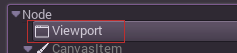
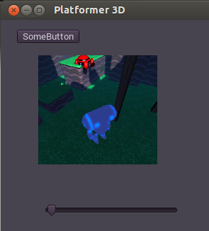

## ビューポート

### イントロダクション

Godotにはかゆいところに手が届くビューポートと言う機能があります。ビューポートはその名の通り、ワールドが描画される長方形です。これには主に3つの使い方がありますが、他にも工夫次第で様々な応用が出来るでしょう。次のようなことがビューポートを通してなされます。



主要な用途はこうです。

* ルートビューポート:アクティブシーンのルートは常にビューポートです。これは、ユーザーが作成したシーンを表示するものです。以前のチュートリアルでやりましたね。

* サブビューポート:ビューポートがControlの子の時に作られます。

* レンダーターゲット:ビューポートは"Render Target"モードにセットすることが出来ます。これはビューポートが直接は表示されず、テクスチャを通してコンテンツにアクセスすることを意味します。

### 入力

ビューポートは、視界を調整したり縮尺を変更したりするために、子ノード全てへの入力イベントを受け付けます。ルートビューポートとサブビューポートはこれを自動的に行いますが、レンダーターゲットは違います。レンダーターゲットは必要に応じて手動でViewport.input()を用いて対応しなけらばならないからです。

### リスナー

Godotは2D、3D双方のノードにおいて3Dサウンドをサポートしています。このことについてはいつか他のチュートリアルで詳しく話します。ビューポートから音が聞こえるようにするには、listenerとして明示的に許可する必要があります。ワールドの描画にカスタムビューポートを使用する際はこの許可を忘れないようにしてください。

### カメラ(2D&3D) 

2Dもしくは3Dでカメラを使用する時(Camera/Camera2D),カメラは常に最も近い親にあたるビューポートに表示されます。これはルートまで遡ります。例えばこのような階層があったとして

* Viewport
	* Camera

カメラは親のビューポートに表示されます。しかしこのような場合

* Camera
	* ViewPort

カメラは表示されません。(サブシーケンスの場合ルートビューポートに表示されます。)

ビューポートに関連付けられるアクティブなカメラは一つにつき一台のみです。そのため、もしカメラをいくつか使いたいのであれば、"current"プロパティを切り替えるか、カレントカメラを呼んでください。

```python
camera.make_current()
```

### 拡大と引き伸ばし

ビューポートには"rect"プロパティがあります。viewポートの幅や高さをピクセルで指定する際、普通はXやYは使われません。(ルートビューポートでは使います。)サブビューポートではそれらの値は親のControlの値によって上書きされますが、レンダーターゲットは自らの解像度をセットできます。

2Dのコンテンツは拡大縮小が可能で、その命令を呼び出すことでビューポートの解像度が任意のrectが明示された他のものだと思わせられます。

```
viewport.set_size_override(w,h) # 2Dカスタムサイズ
viewport.set_size_override_stretch(true/false) # カスタムサイズに応じたストレッチを許可
```

ルートビューポートはプロジェクトセッティングにてストレッチオプションのためにこれを使っています。

### ワールド

3Dの場合、ビューポートはワールドを含みます。これは基本的にはレンダリングと物理学に関連する全てのもの指します。空間ベースのノードは最も近いビューポートのワールドに登録されます。デフォルトでは新しく作られたビューポートにワールドは格納されませんが、親のビューポートと同じワールドを使うことになります。(ルートビューポートはワールドを格納しており、デフォルトで与えられています。)ワールドは"world"プロパティを用いてビューポートの中に設定することができ、そしてその全ての子ノードが親のビューポートのワールドとの関連付けから切り離されます。これは例えば一つのゲームにおいて、別々の3Dのキャラクターを際立たせたいようなシナリオにおいて、特に役にたちます。

シングルオブジェクトを表示するビューポートを作りたいが、ワールドを作りたくないようなシチュエーションにおいて助けになるものとして、ビューポートには自分のワールドを使わせるオプションがあります。これは、3Dキャラクターやオブジェクトを2Dのワールドにインスタンス化する時にとても役に立ちます。

2Dにおいては各ビューポートはそれぞれ独自のWorld2Dを格納しています。ほとんどの場合はこれで十分ですが、もしそれらをシェアしたいケースがあれば、手動でビューポートAPIを呼び出すことで実現可能です。

### キャプチャー

ビューポートが格納しているキャプチャを取得することが出来ます。ルートビューポートにおいてこれは、事実上スクリーンキャプチャーです。これは以下のAPIを使えば実行出来ます。

```
# キャプチャの実行はキューに入れられるので、すぐにはされません。
viewport.queue_screen_capture()
```

1-2フレーム後には(check_process())、キャプチャする準備は完了し、以下のようにしてそれを得ます。

```
var capture = viewport.get_screen_capture()
```

もし返されたイメージが空であれば、キャプチャはまだされていないです。このAPIは非同期的に実行されるものなので、もう少し待ってください。

## サブビューポート

ビューポートがControlの子である時、ビューポートはアクティブになり、その中になにかしらが表示されます。このレイアウトは例えば次のような感じです。

* Control
	* Viewport
	
このビューポートは親のControlのエリアいっぱいに広がります。



### レンダーターゲット

レンダーターゲットとしてセットするには、ビューポートのレンダーターゲットプロパティをトグルして有効化するだけで良いです。中にあるものが全て可視であるわけでは無いことに注意してください。コンテンツを表示するには、レンダーターゲートテクスチャを使う必要があります。これはこのようなコードでリクエストできます。

```
var rtt = viewport.get_render_target_texture()
sprite.set_texture(rtt)
```

デフォルトではレンダーターゲットテクスチャがフレームの中に描かれた時、レンダーターゲットのレンダーダーゲットの再レンダリングが行われます。もし可視であれば、レンダリングがなされｍそうでなければこの再レンダリングは無視されます。この挙動は可視か不可視かに関わらずマニュアルレンダリング(一回)、常時レンダリングに切り替えることもできます。

エディタには、最も一般的な作業をより簡単にするためにいくつかクラスが用意されています。

* ViewportSprite (for 2D)

* ViewportQuad (for 3D)

* ViewportFrame (for GUI)


TODO:ドキュメント2.0にはまだViewportQuadとViewportFrameのドキュメントは用意されていないです。

ビューポートデモは必ずチェックしてください。ダウンロードが出来るビューポートフォルダはデモアーカイブにあります。もしくは

[https://github.com/godotengine/godot-demo-projects/tree/master/viewport](https://github.com/godotengine/godot-demo-projects/tree/master/viewport)
