## アニメーション

### イントロダクション

このチュートリアルは、Godotの全てのアニメーションに通じる方法を説明します。Godotのアニメーションシステムは強力かつ柔軟です。

これには前回のチュートリアル、見栄えのするスクリーンのシーンを使います。シンプルなアニメーションを付加することが目標です。一応コピーを置いておきます。

[robisplash.zip](http://docs.godotengine.org/en/latest/_downloads/robisplash.zip "robisplash.zip")

### アニメーションの作成

まず、AnimationPlayerノードをルートノードbgの子ノードとして追加します。

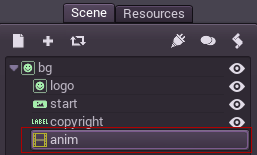

このタイプのノードが選ばれると、アニメーションエディターパネルが現れます。

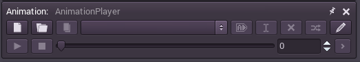

さて、新しくアニメーションを作りましょう。new animationボタンを押して、そのアニメーションに"Intro"と名付けて下さい。

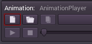

アニメーションが作成されたら"edit"ボタンを押して、編集しましょう。

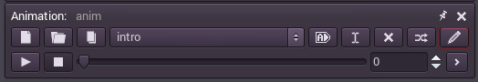

### アニメーションの編集

"edit"ボタンが押されると少し面白いことが置きます。アニメーションエディターがアニメーションパネルに現れます。(Godot 2.xではこのボタンは削除されました。代わりに"animation"トグルをクリックすします。)

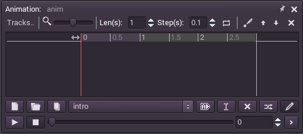

そして次が最も重要な変化です。プロパティーエディタがアニメーション編集モードに切り替わると言うことです。このモードではキーアイコンがあらゆるプロパティに付きます。これは、Godotでは全てのオブジェクトに対してアニメーションを付加できることを意味しています。

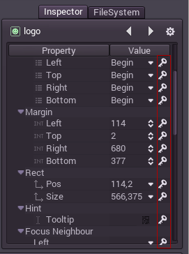

### ロゴの表示アニメーションを作る

次に、ロゴをスクリーン上部から出現させます。アニメーションプレイヤーを選びぶと、エディターパネルは手動で隠さなければ表示され続けます。(アニメーションノードを消せば消えます。)これを使って、"logo"ノードを選択し、"pos"プロパティを選択、114,-400に動かします。

このポジションに移動したら、プロパティの後ろにあるキーボタンを押します。

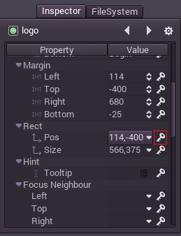

トラックが新しくなると、確認ダイアログが現れます。きちんと確認しておきましょう。

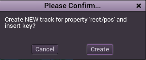

アニメーションプレイヤーエディターにキーフレームが追加されます。

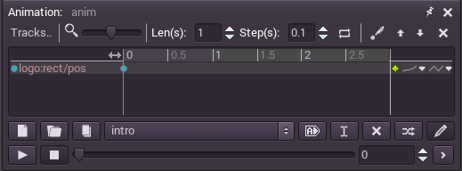

次に、エディタのカーソルをアニメーションの終了ラインに合わせます。ここをクリックしてください。

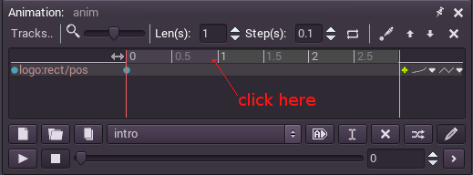

ロコの位置を(114,0)に変え、キーフレームを再び打ちます。2つキーフレームがあるとアニメーションが生成されます。

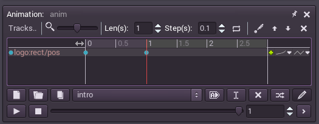

アニメーションパネルでPlayを押すとロゴが降りてきます。シーンを実行してテストがしたいので、シーンが始まる時に自動的に再生するタグをアニメーションに付けます。

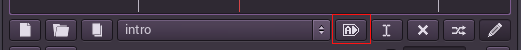

最後に、シーンを再生して、アニメーションがこのように再生されたら成功です。

