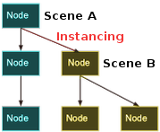
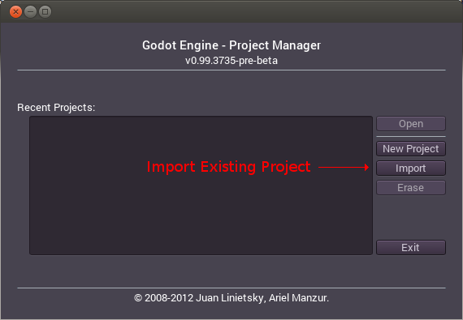
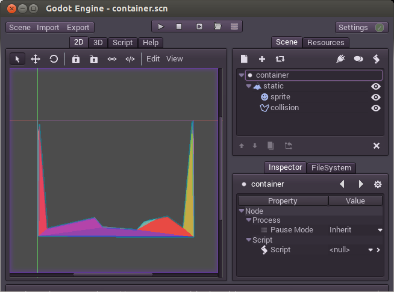
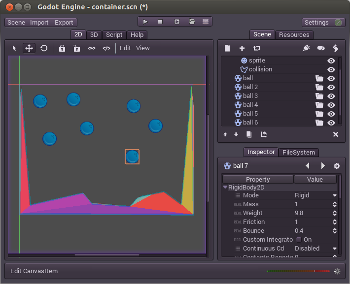
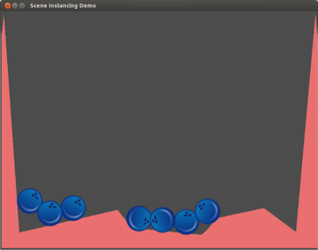

## インスタンス化

### 関連付け

シーンがありその中にノードが入っていれば小規模のプロジェクトとして動いたかもしれませんが、プロジェクトが大きくなってくると、もっともっと沢山のノード使われるようになり、すぐに管理が難しくなります。これを解決するためにGodotではプロジェクトをシーンに分割します。しかし他のゲームエンジンでは同じような仕組みを採用していません。Godotのプロジェクトの構造は他とは全く違うので、このチュートリアルは飛ばさないことをオススメします。

要点:シーンはノードの唯一のルートを持つの木構造のコレクションです。

シーンは作られ保存されます。沢山のシーンが作りたいように作られ、保存されるのです。

その後、既存のシーンや新しいシーンを編集している間、他のシーンをそのパーツとして使うことができます。これがインスタンス化です。

上の画像では、Scene B がScene Aにインスタンスとして追加されています。最初はイメージが掴みづらいかもしれませんが、このチュートリアルが終わる頃には理解出来ているでしょう。

### 少しづつインスタンス化を理解する

インスタンス化をどうやってやるのか学ぶため、まずはサンプルをダウンロードしましょう。

[instancing.zip](http://docs.godotengine.org/en/latest/_downloads/instancing.zip "instancing.zip")

これこのシーン好きな場所で解凍してください。そしてこのシーンをプロジェクトマネージャーのImportボタンでプロジェクトに追加しましょう。

プロジェクトの場所にある"engine.cfg"を開きましょう。新しいプロジェクトがプロジェクトリストに表示されるはずです。Editボタンを押して編集しましょう。

このプロジェクトにはball.scnとcontainer.scnの2つのシーンが格納されています。ボールは物理的な挙動が出来るようになっていてコンテナは衝突を検知出来ます。よってこのコンテナの中にはボールを入れることができます。

コンテナのシーンを開いてルートノードを選択します。

その後プラス(2.1ではではチェーンのマークになっていた)のマークのボタンを押してください。このボタンはインスタンス化ボタンと言います

ボールシーンを選択します(ball.scn)、ボールは原点(0,0)に出現するはずです。これをコンテナの真ん中辺りに動かしてみましょう。

するとシーンはこのようになるはずです。

プレイボタンを押してみましょう。

インスタンスとなったボールがくぼみへ落ちていきましたね。

## もう少し遊んでみよう

このボールは望むだけ増やすことが出来ます。ボールをもっと増やしてみましょう。先ほどやった方法の他に、Ctrl+D(Duplicate)で増やすことも出来ます。

もう一度実行してみます。

どうでしょう、ちょっと楽しく無いですか。これがインスタンス化です。

## インスタンスの編集

沢山コピーした中から一つを選びプロパティエディタで設定をいじってみましょう。もっとバウントするようにしてみますBounceのパラメータを1にしてしまいましょう。

緑色(2.1で白だった)の戻るボタンが現れましたね。このボタンが現れる時はそのインスタンスで固有の値をオーバーライドしたことを意味します。オリジナルのシーンを変更する際は、その書き換える値は常に上書きされます。戻るボタンを押せばプロパティの値をシーン由来のオリジナルの値に戻すことが出来ます。

## まとめ

インスタンス化は一見簡単そうですが、その活用の幅はとても広く奥が深いです。次もインスタンスについてのチュートリアルで、残りをカバーしたいと思います。
