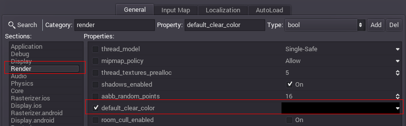
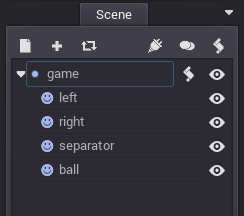

## シンプル2Dゲーム

簡単なチュートリアルとして、ホッケーを作ってみたいと思います。もっと複雑なデモもありますが、まずは2Dゲームを作る上での基本的な機能についてを勉強しましょう。

## 素材

このチュートリアルで使う素材はここにあります。

[pong_assets.zip](http://docs.godotengine.org/en/latest/_downloads/pong_assets.zip "pong_assets.zip")

## シーンのセットアップ

古いゲームっぽくするために、このゲームの解像度は640x400ピクセルとします。Project Settingから設定できます。(詳しくはプロジェクトの設定をご覧ください)デフォルトの背景色は黒となっています。



プロジェクトルートとしてNode2Dノードを作って下さい。Node2Dノードは2Dエンジンのベースタイプです。その後、スプライト(Sprite node)を加え、対応するテクスチャをセットします。最終的にこのようなレイアウトにしてください。なおボールは中央にあります。


シーンツリーはこのようになっているはずです。



シーンを"pong.scn"で保存し、プロジェクトプロパティでメインシーンを設定します。

## アクションの入力を設定

ゲームには様々なインプットデバイスが考えられます。キーボード、ジョイパッド、マウス、タッチスクリーン、またマルチタッチの可能性もあります。しかしこれはホッケーです。せいぜいパッドを上下させる程度の操作しか必要ありません。

されうる全ての入力について考えようと思うと、フラストレーションも貯まりますし、コードも膨大になるでしょう。ほとんどのゲームで採用されているキーコンフィグを実装しようとおもうと更に大変です。これを解決するため、Godotは"Input Actions"を作ります。アクションを決め、それのトリガーを設定できるツールです。

プロジェクトプロパティダイアログを開き、"Imput Map"タブを開きます。

そして、left_move_up、left_move_down、right_move_up、right_move_downという4つのアクションを追加し、好きなキーを割り当てます。左のプレイヤー用にAZ、右のプレーヤーようにUP DOWNあたりが適当でしょう。


## スクリプト

シーンのルートノードにスクリプトを追加し、開きます。(詳しくはスクリプトの追加を読んでください。)Node2Dを継承します。

```python
extends Node2D

func _ready():
	pass
```

コンストラクタでやりたいことは2つあります。プロセスの有効化と使う値の設定です。値はスクリーンとパッドの大きさがあればよいでしょう。

```python
extends Node2D

var screen_size
var pad_size

func _ready():
	screen_size = get_viewport_rect().size
	pad_size = get_node("left").get_texture().get_size()
	set_process(true)
```

さらに変数をいくつか追加します。

```python
# ボールの速度(pixel/second)

var ball_speed = 80

# ボールの方向(基底ベクトル)

var direction = vector(-1, 0)

# パッドのスピードの定数(pixel/second)

const PAD_SPEED = 150
```

プロセスを定義したら終わりです。

```python
func _process(delta):

```

計算に使う値を用意しましょう。まずボールの位置が必要です。これはノードから取得できます。次にパッドごとの長方形の情報が必要です。これはRect2で取得できます。デフォルトではスプライトの位置はテクスチャの真ん中のものなので、pad_size/2の調整が必要です。

```python
var ball_pos = get_node("ball").get_pos()
var left_rect = Rect2( get_node("left").getpos() - pad_size/2, pad_size )
var right_rect = Rect2( get_node("right").getpos() - pad_size/2, pad_size )
```

ボールの位置を正確に得るにはこのようにすれば良いですね。

```python
ball_pos += direction * ball_speed * delta
```

そして、ボールが新しい位置へ動く時に様々なテストを噛ませます

下端と上端について:

```python
if ( (ball_pos.y < 0 and direction.y < 0) or (ball_pos.y > screen_size.y and direction.y > 0)):
    direction.y = -direction.y
```

パッドにあたった時は少し加速するようにしましょう。

```python
if ( (left_rect.has_point(ball_pos) and direction.x < 0) or (right_rect.has_point(ball_pos) and direction.x > 0)):
    direction.x = -direction.x
    ball_speed *= 1.1
    direction.y = randf() * 2.0 - 1
    direction = direction.normalized()
```

ボールがスクリーンを出たらゲームオーバーですね。ゲームのリスタート処理も書きましょう

```python
if (ball_pos.x < 0 or ball_pos.x > screen_size.x):
    ball_pos = screen_size * 0.5  # ball goes to screen center
    ball_speed = 80
    direction = Vector2(-1, 0)
```

これらが全て終わったら、ノードの位置をもう一度更新します。

```python
get_node("ball").set_pos(ball_pos)
```

パッドはプレイヤーの入力に応じて更新します。Inputクラスがとても役にたちます。

```python
# 左のパッドを動かす
var left_pos = get_node("left").get_pos()

if (left_pos.y > 0 and Input.is_action_pressed("left_move_up")):
    left_pos.y += -PAD_SPEED * delta
if (left_pos.y < screen_size.y and Input.is_action_pressed("left_move_down")):
    left_pos.y += PAD_SPEED * delta

get_node("left").set_pos(left_pos)

# 右のパッドを動かす
var right_pos = get_node("right").get_pos()

if (right_pos.y > 0 and Input.is_action_pressed("right_move_up")):
    right_pos.y += -PAD_SPEED * delta
if (right_pos.y < screen_size.y and Input.is_action_pressed("right_move_down")):
    right_pos.y += PAD_SPEED * delta

get_node("right").set_pos(right_pos)
```
