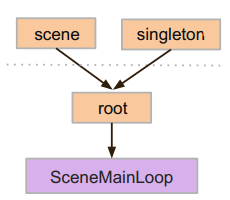
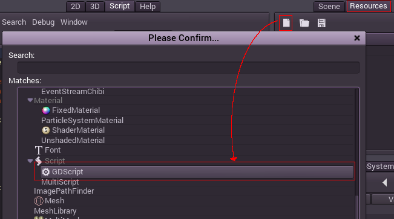
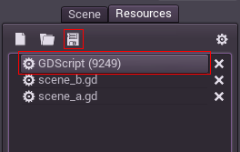
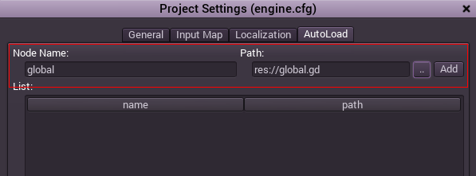

## 単量子(オートロード)

### イントロダクション

シーン単量子は、同じ情報を格納しなければならない、シーン間で共通するユースケースにおいてとても役に立ちます。

シーンシステムは非常に強力なのですが。いくつか欠点があります。

* 複数のシーンにまたがる情報を保持するのに便利な場所が用意されていない。(プレイヤーのアイテムなど。)

* 子のシーンに共通する情報を格納することはシーンを子シーンとしてロードしたりアンロードしたりすることで可能ですが、この場合シーンの動きをきちんと予想しながら動かすことは不可能に近くなります。

* 情報はディスクの"user://"に格納することができ、それをシーンから読み込むことも出来ますが、このデータは断続的にセーブ、ロードされることになり、シーンの変化が扱いにくく遅いものになってしまうでしょう。

しかし、シーンのパーツを作る時に以下のようなことが求められます。

* エディタでどんなシーンが開かれても、いつもロードされていること。

* プレイヤー情報、アイテム、お金などのグローバル変数を格納し、シーン感で共有出来ること。

* シーンの切り替えや移行を制御出来ること。

* GDScriptがグローバル変数をサポートしない仕様であることから、単量子のように振る舞うこと。

オートロードノードはこれらのニーズを満たします。

### オートロード

オートロードはシーンや、ノードから継承されたスクリプトをロードするときに使えます。(ノードが作成されスクリプトがセットされます。

シーンやスクリプトをオートロードするには、Sceme>Project Settingsをメニューから選択し、Autoloadタブに切り替えてください。リスト項目の各々には名前が必要で、それがノードの名前として使われ、そのノードは常に他のシーンがロードされる前にルートビューポートに加えられます。



これは、全てのノードが単量子player_varsにアクセスできることを示します。

```pyhton
var player_vars = get_node("/root/playervariables")
```

### カスタムシーンスイッチャー

オートロードを用いたシーンスイッチャーの作り方を実際に作りながら説明します。シンプルなシーンスイッチングならSceneTree.change_scene()メソッドを使えば十分です(詳細はSceneTreeへ)ので、これからやるメソッドは、シンプルで無い複雑なスイッチャーを実装するためのものです。

最初にこのテンプレートをダウンロードして開いて下さい

[autoload.zip](http://docs.godotengine.org/en/latest/_downloads/autoload.zip "autoload.zip")

シーンがscene_a.scnとscene_b.scnの2つ存在し、その他には何も無いプロジェクトです。これらは同一のもので、別のシーンにスイッチするためのボタンが格納されています。プロジェクトを実行すると、scene_a.scnが読み込まれます。これはまだ何も出来ないシーンです。ボタンも機能しません。

### global.gd

まず始めに、global.gdスクリプトを作ります。リソースを作成するにはリソースタブを使うのが簡単です。



global.gdスクリプトを保存します。



スクリプトはスクリプトエディターで開くことを推奨します。次のステップは、作ったスクリプトをAutoLoadリストに追加することです。メニューからScene>Project Settingを開き、AutoLoadタブに切り替え、新しく"global"をファイルパスを作ったスクリプトの場所に指定して追加しましょう。



これを追加した瞬間から、どのシーンを走らせてもスクリプトが常にロードされるようになりました。

スクリプト本体に話を戻します。カレントシーンをは_ready()関数に呼ばれる必要があります。カレントシーンとglobal.gdは両方ルートの子ですが、オートロードされたノードのほうが上の兄弟になります。これは最後の子が普通にロードされたシーンであることを表します。

注意:global.gdがノードを展開することを了承してください。これをしないとロードされなくなります。

```python
extends Node

var current_scene = null

func _ready():
        var root = get_tree().get_root()
        current_scene = root.get_child( root.get_child_count() -1 )
```

次に書いてあるのはシーンを変えるための関数です。この関数はカレントシーンを解放し、リクエストしたものに置き換えます。

```python
func goto_scene(path):

    # この関数は通常、シグナルのコールバックとして、または
    # 実行しているシーンの他の関数から呼ばれます。
    # カレントシーンをここで削除してはいけません、
    # なぜならこれは何かのコールバックの一部だからです。
    # 最悪異常動作してクラッシュしてしまいます。

    # 関連したこの方法はカレントシーンがなんのコードも
    # 実行していないことが確認された時、ロードを後に遅らせています。

    call_deferred("_deferred_goto_scene",path)


func _deferred_goto_scene(path):

    # カレントシーンを直ちに解放します、
    # リスクが無い方法です。
    current_scene.free()

    # 新しいシーンをロード
    var s = ResourceLoader.load(path)

    # シーンをインスタンス化します。
    current_scene = s.instance()

    # アクティブなシーンを子ノードとして追加します。
    get_tree().get_root().add_child(current_scene)

    # 応用的な方法として、SceneTree.change_scene() APIを同時に使うことも出来ます。
    get_tree().set_current_scene( current_scene )
```

上のコメントのように、私達が本当に避けたいのは、シーンが使われている(関数のコードが動いている。)にも関わらず消されてしまうというシチュエーションですので、そのためにObject.call_deferred()を使う必要があります。

これを使うことで、カレントシーン由来のコードが全て終わってから次の関数のコマンドを実行することが出来ます。

最後にscene_a.gdとscene_b.gdの空の関数を完成させます。

```python
# scene_a.gdに追加

func _on_goto_scene_pressed():
        get_node("/root/global").goto_scene("res://scene_b.scn")
```

と

```
# scene_b.gdに追加

func _on_goto_scene_pressed():
        get_node("/root/global").goto_scene("res://scene_a.scn")
```

これで、プロジェクトを実行した時に、ボタンを押すことでシーンを切り替えることが出来ます。次のチュートリアルでは、シーンをプログレスバー付きでロードします。
